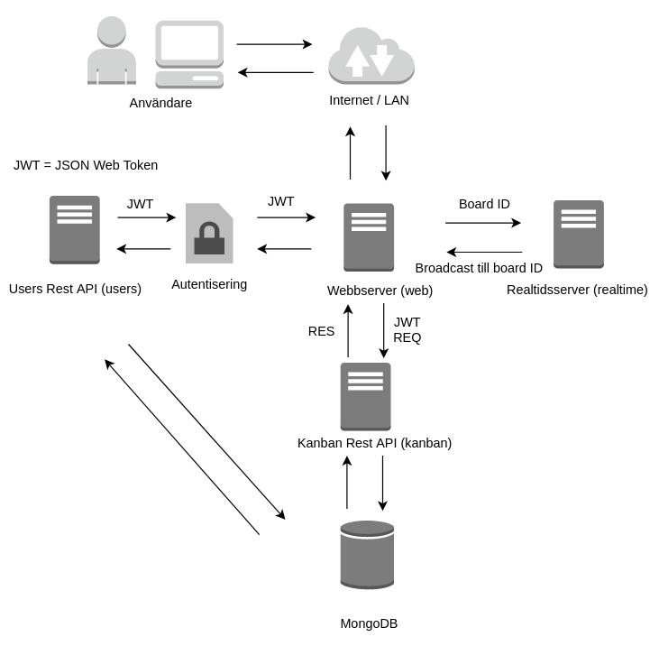

[](https://scrutinizer-ci.com/g/skvist/kanban/?branch=master)
[](https://scrutinizer-ci.com/g/skvist/kanban/?branch=master)
[](https://scrutinizer-ci.com/g/skvist/kanban/build-status/master)


# Kanban

This is my final project in the course Ramverk2 at Blekinge Institute of Technology.
It is a Kanban board made for agile development, with features similar to Trello.
I have built it with a microservices architecture in mind, it consist of five servers; Web server, User Rest-API, Kanban Rest-API, Realtime WS and a MongoDB.

The following documentation will be in Swedish.

## Bakgrund

Kanban härstammar från bilindustrin i Japan men har anammats inom många områden, däribland web/mjukvaruutveckling, där det ibland används inom exempelvis agil utveckling.
Det hjälper till visualisera arbetsflödet, så att man får en överblick av projektet och kan följa vare feature från start till slut.


## Innehållsförteckning

Gå till dokumentation för [User RESTful API](services/users/README.md)

Gå till dokumentation för [Kanban RESTful API](services/kanban/README.md)


* [**Bakgrund**](#bakgrund)
* [**Applikationen**](#applikationen)
* [**Arkitektur**](#arkitektur)
* [**Kravbild**](#kravbild)
* [**Installation och start**](#installation-och-start)
    * [Hämta från GitHub](#hämta-från-github)
    * [Installera](#installera-paket-för-alla-tjänster)
    * [Starta](#starta-alla-tjänster)
    * [Utveckling](#utveckling)
* [**Konfigurera**](#konfiguration)
* [**Test**](#test)
    * [Starta test](#starta-test)
    * [Omfattning](#omfattning)
    * [Testverktyg](#testverktyg)
* [**Continuous integration**](#continuous-integration)
* [**Tekniker**](#tekniker)
    * [Kanban](#kanban-tjänst)
    * [Users](#users-tjänst)
    * [Realtid](#realtime-tjänst)
    * [Web](#webb-tjänst)
* [**Databas**](#databas)
* [**NPM-modul**](#npm-modul)
* [**Docker**](#docker)


## Applikationen

Projektet är uppbyggt med en microservices-arkitektur när det kommer till att ha tjänsterna uppdelade, för detta projekt så är allt samlat under ett repo och ingen vikt har lagts på skalning och liknande.
Följande tjänster används: Web (frontend), Users (Rest API), Kanban (Rest API), Realtime och MongoDB-server.

## Arkitektur



Katalogstruktur

```
kanban
├── data
│   └── db
├── services
│   ├── kanban
│   │   └── src
│   │	     └── models
│   ├── realtime
│   │   └── src
│   ├── users
│   │   └── src
│   │	     └── models
│   └── web
│        └── src
└── tests
```

---
### Kravbild
Grundtanken är en variant av [Trello](https://trello.com/]), där en användare kan skapa ett Kanbanbräde. Sedan kan användaren på brädet lägga till features i en Backlog och under arbetets gång flytta över dem till In Progress när arbetet är påbörjat, sedan Test och till sist Done när en feature är klar.

Det är helt enkelt en tavla med fyra kolumner där man flyttar runt Post-it-lappar för att visualisera ett projekt.

Användaren ska kunna:
- Skapa ett nytt konto
- Skapa ett nytt bräde
- Ge behörighet till sitt bräde till andra användare
- Skapa nya features med en titel och beskrivning
- Redigera features
- Flytta features till andra kolumner
- I realtid se vilka användare som arbetar på brädet
- I realtid se ändringar som andra användare gör

Då projektet måste ha ett begränsat scope och är mer av ett Proof Of Concept, så har följande delar valts bort (det mesta är förberett på API-nivå för att enkelt kunna implementeras):
- Profiler/hantera sitt konto
- Super-admin
- Tilldela features till användare
- Radera bräden/features
- Tidslogga
- Felmeddelanden visas på engelska

---

## Installation och start

För att starta projektet från grundkatalogen så krävs Docker och Docker-compose, därför måste dessa vara installerade och kunna köras utan sudo.

### Hämta från GitHub

```
git clone https://github.com/skvist/kanban.git
```

Varje tjänst går att installera och starta separat från respektive katalog för vidareutveckling med motsvarande kommandon.
Nedan följer instruktioner om hur allt startas upp tillsammans, notera att Docker då används och att webbtjänsten byggs.

### Installera paket för alla tjänster
```
# ./kanban/

npm install
```
### Starta alla tjänster

När start körs så får man välja en startport, exempelvis 5000, då kommer portarna 5000 till och med 5004 att användas. Allt startar i docker-containrar.
Om inget väljs så används portarna 3000-3004

Webbservern nås på den valda startporten, ex http://localhost:3000.

```
# ./kanban/
npm start  # npm run start-docker
```
### Utveckling

Vid utveckling av tjänsterna så kan de startas från respektive katalog, de körs med fördel i separata terminaler för att kunna se utskrifter.

```
# ./kanban/services/<service>/
npm start  # node src/server.js
```
Alternativ för hot reloading
```
# ./kanban/services/<service>/
npm run dev  # nodemon src/server.js / webpack för webbtjänsten

```
## Konfiguration
Följande miljövariabler används, motsvarande variabler skapas även i `.env` som Docker har tillgång till:

- DBWEBB_PORT_0=3000 # Web
- DBWEBB_PORT_1=3001 # Users
- DBWEBB_PORT_2=3002 # Kanban
- DBWEBB_PORT_3=3003 # Realtime
- DBWEBB_DSN=mongodb://mongodb:3004/kanban # MongoDB
- DBWEBB_MONGO_PORT=3004 # MongoDB port

Vid `npm start` så körs skriptet `setports.sh` där dessa sätts i det aktiva skalet.

Skriptet skapar även en `.env`-fil som docker-compose använder, samt filen `services/web/src/config.js` skapas på nytt med de valda portarna.

---
## Test

Då tjänsterna är relativt små och främst hämtar data och använder sig av middlewares som är beroende av databasen så görs det integrationstester istället för enhetstester.
Därför startas en en MongoDB-server med Docker upp (mongodb-test) som har en seprarat dokumentdatabas under `data/db-test` innan testerna utförs.

MongoDB-servern går mot port 3010, om en annan ska användas måste det konfigureras i både `package.json` och `docker-compose.yml`.

Alla tester finns under `./tests`

#### Starta test
```
npm test
```

Det går även att testa med enbart Docker med följande kommandon:

```
npm run test-docker # node 8.9-alpine
npm run test-docker1 # node 9.3-alpine
npm run test-docker2 # node 6 fungerar ej, borttagen
```

#### Omfattning

Det som testas automatiskt är alla anrop och svar till Users och Kanban-API:erna, modellernas validering samt http-anrop till öppna routes.

Då Web är front-end så finns det än så länge inget funktionstest för den, främst på grund av eventuella lokala problem med Selenium ifall X-server saknas.
Realtidstesterna är inte tillräckligt tillförlitliga för att göra nytta.
Dessa delar testas därför enbart manuellt i nuläget.
Samtliga `server.js` har exkluderas då de bara startar upp respektive server.

Ett antal försök gjordes av att mocka/stubba databasen, men utan någon vidare lycka, därför körs den via Docker.

#### Testverktyg

De verktyg som används är mocha, chai, chai-http och istanbul/nyc.

Chai-http har fungerar riktigt bra till i princip alla tester, då servern kan mockas istället för att startas. Då det är Rest-API:er som integrationstestas så passar det utmärkt då det på ett enkelt sätt kan utföra de olika http-anropen och skicka med både Basic auth och en body.

Istanbul/nyc används för att visa coverage.
Kodtäckningen hittas i `./coverage/index.html`.

---
## Continuous integration

Endast Scrutinizer CI används, då den täcker både build, coverage och kvalite.
Den ger omfattande tips om vad som kan förbättras i exempelvis bästa arbetssätt, stil och komplexitet.

Den ger bra information, även om det i detta projekt är lite missvisande då exempelvis flertalet console.logs används för att skriva ut debuginformation. Detta kan ju så klart enkelt ordnas, men vi nöjer oss med att ha det så här när det fortfarande är i utvecklingsstadiet.

---

## Tekniker

Då flertalet tekniker har använts blir det omfattande att skriva om de i detalj, men samtliga har fungera bra och har enligt mitt tycke väldigt bra dokumentation samt stora användarbaser, vilket gör att det är lätt att hitta svar på sina frågor.


#### Kanban-tjänst

[Dokumentationen](services/kanban/README.md)

Restful-API som hanterar Kanban-bräden och items/features.

Tekniker:
- Node/Express
- JSON Web Token
- Mongoose
- CORS


#### Users-tjänst
[Dokumentationen](services/users/README.md)

Restful-API som hanterar användare och inloggning.

Tekniker:
- Node/Express
- JSON Web Token
- Mongoose
- Bcrypt
- CORS

#### Realtime-tjänst

Realtidsservern använder Node/Express och socket.io.

Socket.io har funktioner som hanterar namespaces/rum, dit det går att broadcasta meddelanden till alla sockets som kontakt till det rummet, istället för att broadcasta till hela servern. Detta förenklade det hela väldigt mycket i jämförelse med att använda rena WebSockets.

När en användare öppnar ett bräde så skickas ett room-meddelande som innehåller användarnamn och brädets ID, där ett nytt rum öppnas med brädets ID, om rummet finns så ansluter socketen till det.
I klienten så visas alla användare som är anslutna till respektive bräde.

När en användare sedan gör någon uppdatering, som att flytta eller redigera en feature så skickas ett uppdateringsmeddelande, vilket broadcastas i rummet och alla användare hämtar alla features på nytt.


#### Webb-tjänst
[Installations instruktioner](services/web/README.md)

Webbapplikationens frontend som knyter samman alla tjänster med varandra.

Som grund till allt så används Javascript-ramverket [Vue](https://vuejs.org/) vilket är ett väldigt trevligt och lättanvänt ramverk som går snabbt att sätta sig in i. Vue har följt med sedan första kursmomenten och därför föll det naturligt att välja det till projektet.

Övriga tekniker:
- CSS-ramverket [Bulma](https://bulma.io/) används tillsammans SCSS.
- Beufy - Färdiga Vue-komponenter för Bulma
- Axios för HTTP-anrop
- Socket-io-client för realtidsdelen
- Vue Draggable - bibliotek för dra-och-släpp (baserat på Sortable.js)
- Webpack för utveckling och builds

---

## Databas

MongoDB används tillsammans med node-biblioteket Mongoose.

Med Mongoose så kan man definiera Schemas, vilket gör att man mer eller mindre definierar hur dokumenten ska se ut i likhet med kolumner i SQL med typer och krav, vilket samtidigt tar bort lite av poängen med NoSQL. Det blir även likt AR/ORM som i att man hanterar objekt om man så vill.

Egentligen hade det fungerat lika bra med ren MongoDB i och med att jag inte använde Mongoose fullt ut, det vi mest fick ut av det var validering av fälten.

Framöver kan jag tänka mig att använde både NoSQL och SQL beroende på projekt.
Om transaktioner är väldigt viktiga så kommer SQL att användas, men är hastigheter viktigare (eller Big Data) så kommer det luta mot NoSQL.

---

## NPM-modul

Den enda egna modulen/middlewaret som används är [express-jwt-verify](https://www.npmjs.com/package/express-jwt-verify) på Kanban-tjänsten för att kontrollera så att den token som skickas med är korrekt.

NPM känns lite som ett svart hål, där det trots bara några få paket fylls upp med hur mycket som helst och man tappar lite kontrollen över vad som finns. Men det är samtidigt riktigt smidigt att använda och då det är så pass populärt så går det att hitta det mesta.


---

## Docker

Imagen skvist/docknode används för alla containers, exklusive Web som körs på nginx:stable-alpine.

När det handlar om flertalet tjänster som köras och utvecklas separat så är det otroligt smidigt att kunna sätta upp och starta hela servermiljön med Docker.
Det enda negativa jag kan se är att det kan kräva en hel del tid i anspråk att sätta upp (och göra förändringar) i miljöerna/builds.


[skvist/docknode](https://store.docker.com/community/images/skvist/docknode)

[docknode på GitHub ](https://github.com/skvist/docknode)

---

### Niclas Söderkvist - niso16 - niclas.soderkvist@gmail.com
